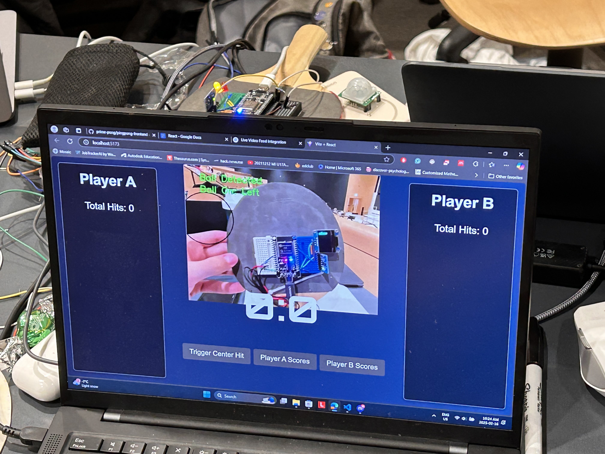
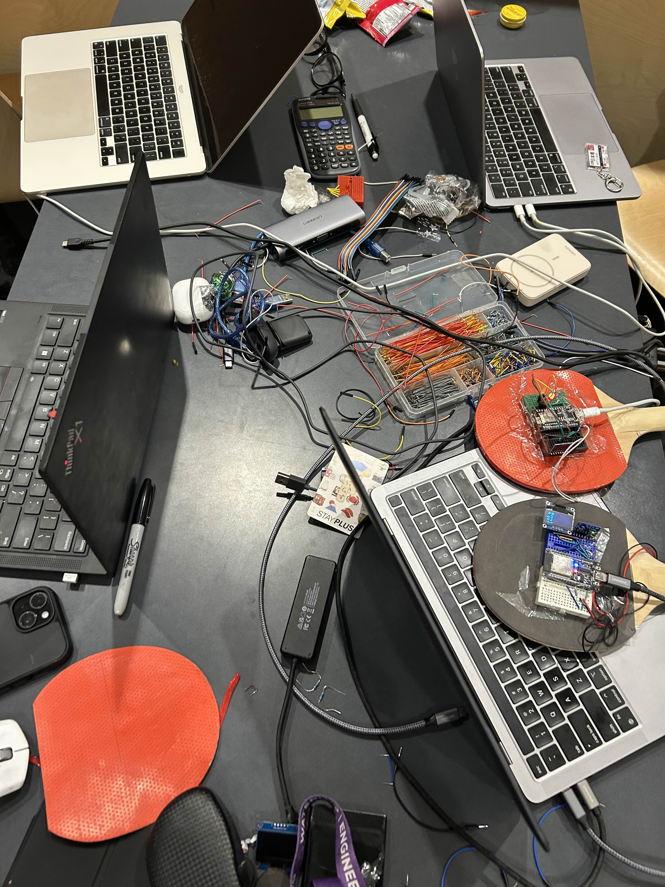

# PrimePong

PrimePong is a project developed at MakeUofT 2025 and placed third of out 66 teams. Below is the [Devpost](https://devpost.com/software/primepong) re-write followed by a gallery of the project itself.

## Description

### Inspiration

Stefan developed an interest in ping pong recently and hasn’t stopped bragging about his skills. Despite his self-confidence, he isn’t the smartest man in the room and is highly forgetful. Stefan wished for a way to be able to keep score and gamify the classic game of Ping Pong by having additional ways to score. Introducing PrimePong!

### What it does
PrimePong utilizes modded paddles that sense the paddle's acceleration and force to detect swings and hits. The OpenCV footage outlines the table to set the boundaries and calculate the points system. The React + Vite website compiles all our components to display a ping pong webpage for the game and auto-delegates points.

### How we built it
We used 2 microcontrollers an ESP32 and an ESP8266 one for each paddle, each equipped with an MPU6050 accelerometer on the back, and a force sensor on the front. The accelerometer and force sensor collected data, and calculated values for different hits and swings. Using HTTP protocol the microcontrollers sent the hit-and-swing data to the front-end website.

### Challenges we ran into
One of the first challenges we ran into was the accelerometer of the ESP32 not registering. This was solved by adding an extra library that was not needed for the ESP8266. The force sensor was finicky and over time one of the 2 stopped being responsive. Since the ping pong ball is light the sensor's sensitivity needed to be turned up really high to get consistent hits. Since OpenCV uses different colours to differentiate objects, our tables, floor, ball, and paddle had similar shades so we recoloured each object. We covered the table and net in the white paper, striped the paddles of the red pads, and coloured the ping pong ball with black Sharpie, and blue corner sticker.

### Accomplishments that we're proud of
We are happy that we were able to integrate all the separate hardware/software components we all worked on individually, even though version control was our worst nightmare for this project. Another accomplishment we are proud of was being able to build out everything we envisioned before starting the hackathon.

### What we learned
We learned how to communicate our serial data from our ESP32s to our frontend React.js scoreboard using HTTP requests. We navigated through working with new drivers, new libraries, new sensors, new frameworks, and more. We learned that all-nighters may not be the best idea, but it’s the hard work that makes our project come alive.

### What's next for PrimePong
We want to be able to add more features to our product, such as adding more camera angles, training a machine learning model to enhance the accuracy of the game metrics, and sizing down our hardware to make our product more feasible to the players of Ping Pong.

## Gallery

Paddle #1 (ESP32, MF02A-N-221-A01 force sensor, MPU6050 accelerometer, SSD1306 OLED display, pull up resistors)

Paddle #2 (ESP8266, MF02A-N-221-A01 force sensor, MPU6050 accelerometer, LEDS, pull up resistors)

Modded Table Tennis Table

Scoreboard (React.js + Vite)

Workstation